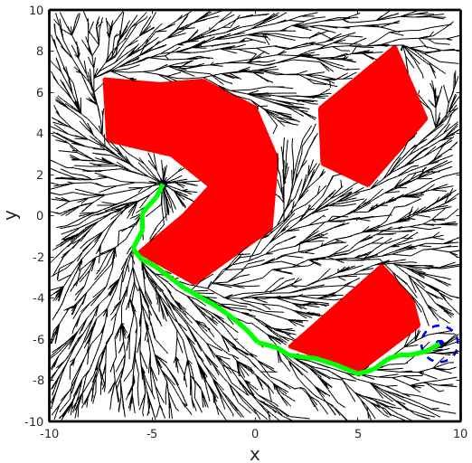

# rrt_star
A matlab implementation of the RRT* algorithm in 2D

Files can be obtained with the following command:

``git clone https://github.com/adrianomcr/rrt_star.git``

## How to use

After cloning this repository, just run the script RRT_star.m

### You will be asked to:

- Insert the world number (options saved in the directory "SavedWorlds"). If you insert the number 0, you will be able to create a new world and save it if you would like (See the topic "How to create a world").

- Insert the initial point and final region. You can do this by clicking on the figure.

- Insert the number of nodes of the final tree

### How to create a world:

- First insert the dimension of the rectangular workspace in the form [min_x max_x min_x max_y]. For instance, a rectangle with size 4x2 corresponds to [0 4 0 2] or even [-2 2 -1 1].

- Insert the number of obstacles to be created

- Use the left click to insert the vertexes of a polygonal obstacle on the figure. Use a right click to finish the obstacle

- After you create all obstacles, insert a number to save the world you just created. In the next run you can simply select this number.
 

## Expected result:

Example of an expected result. Tree with 3000 nodes

